## Unit 4 - Bots - Chapter 2 Implement your bot

### Build it:

Now that you have see the Mad Libs bot in action, let's build it!

1. Log into the [Bot builder website](https://va.ai.dynamics.com) using the account provided to you in class. 
   
1. Once logged in, click the bot icon in the upper right, and then press the new bot button.

    

1. You will now asked to name your bot and tell it what environment it will live in. Let's name our bot "Mad Libs Bot" and put it in the "Developer Environment", and then press the "Create" button. It will take a few minutes for your bot to be created.
   
    > NOTE: that you have to press the options drop down to set the environment. 

    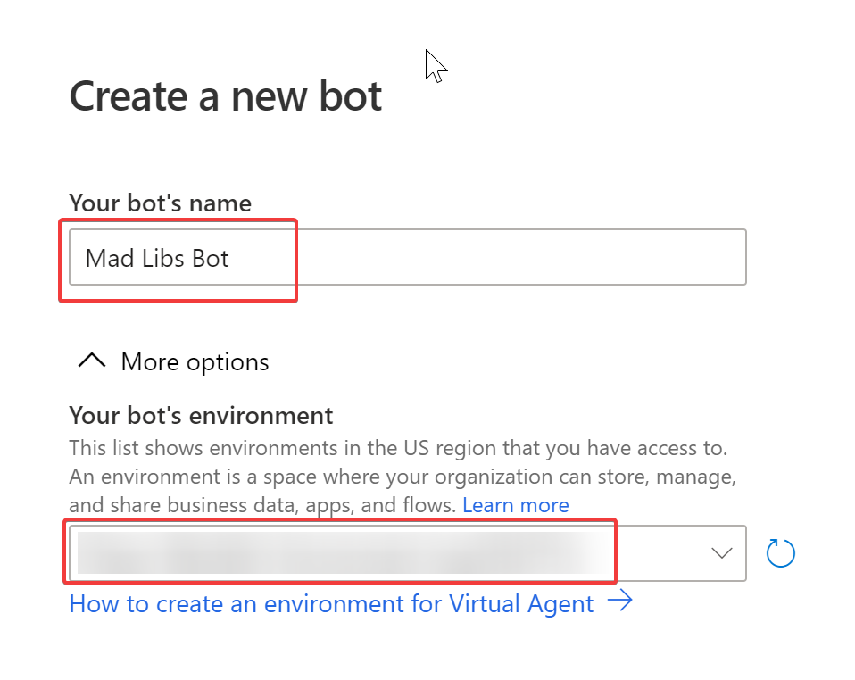

1. When the bot is created, there are some sample topics that we need to delete. Select "topics" from the navigation on the left, and then press the "trash can" next to each of the "user topics" to delete them. NOTE: you should not modify the "system topics".

    

1. Now we are ready to create our first topic. The purpose of this topic is to start the "Mad Libs" game. Press the new topic button. Set the title to "Mad Libs Greeting", and the description to "This topic will start the Mad Libs Game". 
   
1. Our topic will need 5 trigger phrases. Add the follwing:
   1. "Start the Game"
   1. "I want to play a game"
   1. "Mad Libs game"
   1. "ml"
   1. "game time"

1. It should look like this, then press the conversation "edit" button

    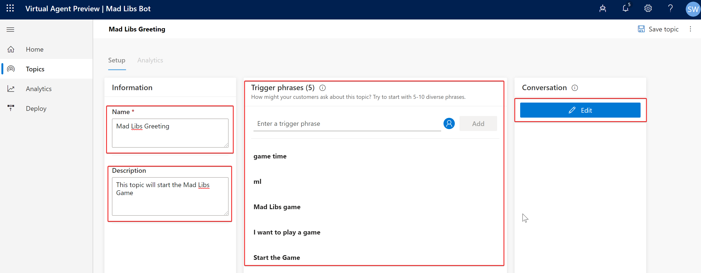

    You should now see an empty topic, with your trigger phrases at the top and an empty "Bot Says" box.

    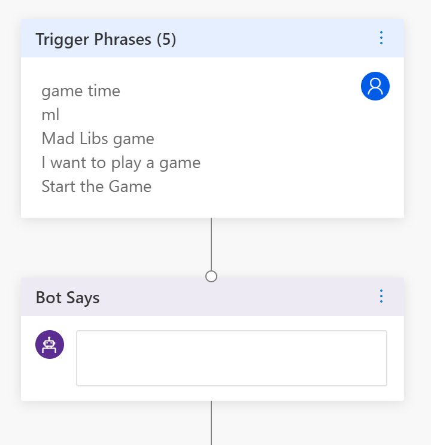

1. In the "Bot Says" box, enter the text "What Mad Libs would you like to do?"

1.  Now click "user says" from the bot design surface, and enter "Story 1" as the first option. It should look just like this. 

    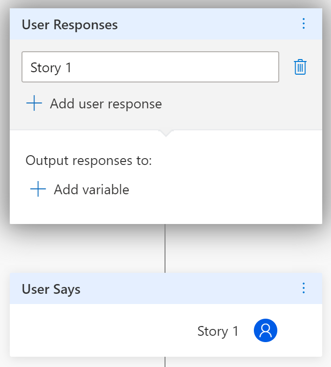

    Since we have not created our first Mad Lib yet, we will need to come back here to attach this "users says" to our Mad Lib. 

1. However, Lets add a "fallback" option if our user enters a response that we are not expecting. If you put your mouse over the line connecting the "user responses" to the "users says" you should see a little "plus sign" clicking on it will provide you a menu to add a "fallback"

    

1. In the fallback branch (i.e. the one that says "none of these user responses") add a bot says with the following text "I don't have that one, please try again.". It should look like this. And then save your changes using the button in the upper right. 

    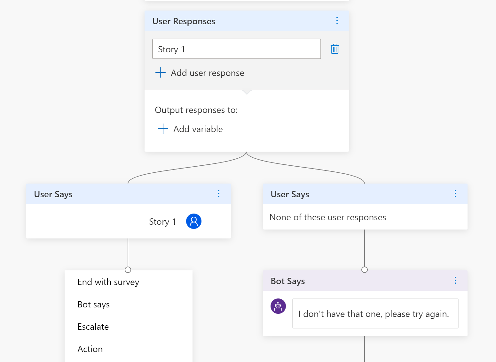

1. Now lets, create a new topic our "Mad Libs Close". After our user completes the Mad Libs Game this topic will thank them. Start by clicking "topics" from the menu on the left and then "new topic".

    

1. Enter the Name of this topic "Mad Libs Close" and give it a description "This topic will end the Mad Libs Game". This topic will not have any triggers, so you can press "edit" to sart adding the conversation. 

    

1. The bot will now thank the user for playing and ask them if they want to play again. Add a bot says with the following text "Thank you for playing my game! Would you like to play again?"

1. The user response will be either "Yes" and "No", add these to the bot designer. Your topic should look like this now. 

    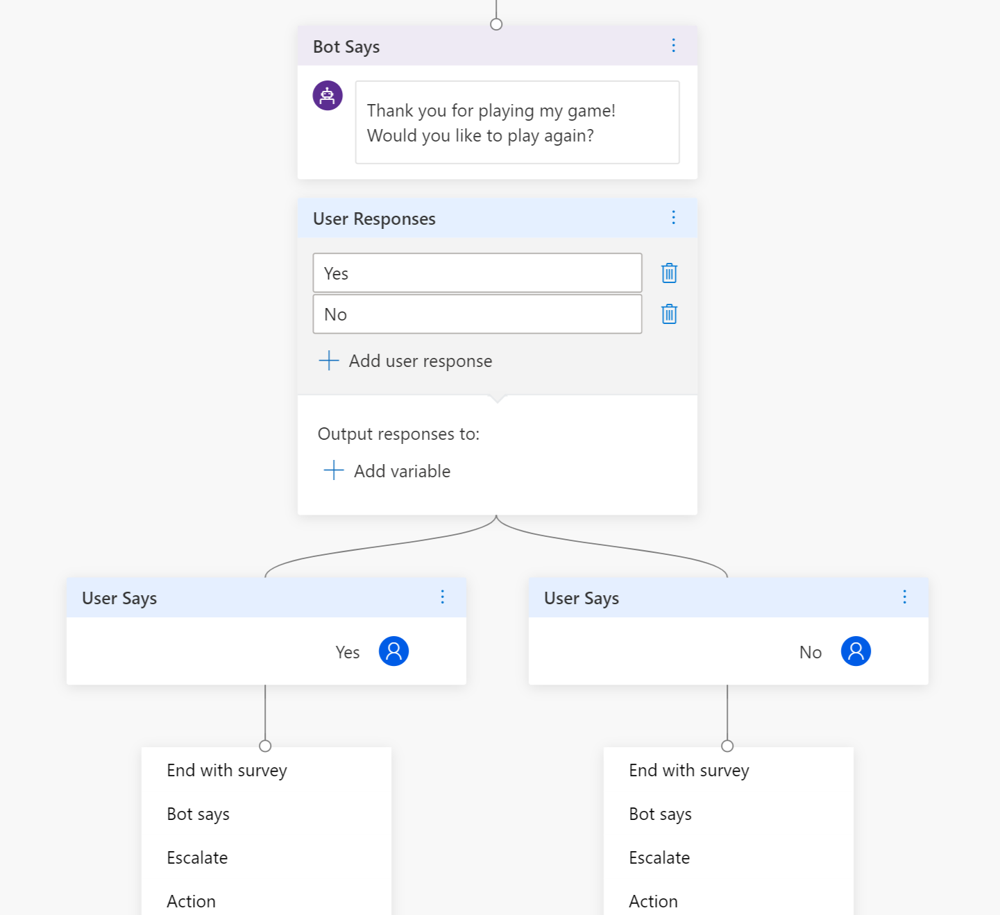

1. Now lets tell the yes branch to Go to the "Mad Libs Greeting" topic, and tell the no branch to go to the "Goodbye" topic. It should now look like this. And then save your changes using the button in the upper right. 

    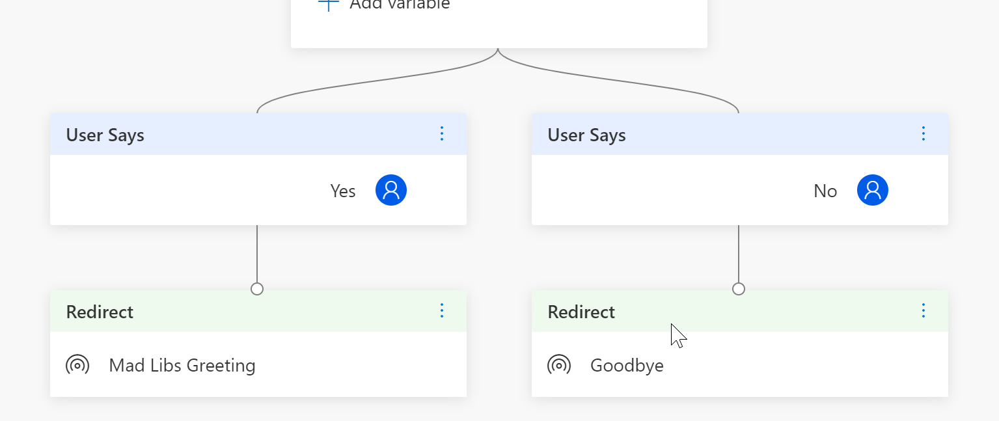

1.  Now that we have created topics for starting and ending our game, lets program our first mad libs game. 

1. Lets create a new topic called Story 1.  Start by clicking "topics" from the menu on the left and then "new topic".

    

1. The title for our topic will be "Story 1" and the description will be "this topic will show the user the first story". Like the close topic, this topic will not have any trigger phrases, so you can just start editing the conversation. 

    

    Rembember that our first story looks like this.
    

1.  So our bot needs to ask our user for the exclamation value to fill in the first blank. In the Bot Says box enter "Question 1: Tell me an exclamation?".

    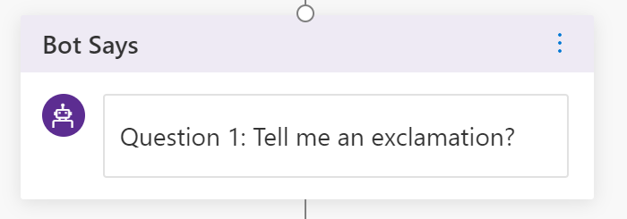

1. Now we need to collect the answer to the first question and store that value in a variable. We do that by adding a "User Says" to the bottom of our conversation. There will be no choices so you need to delete the empty response that is created by default.  

    

1. Now we can create the variable that will hold the answer. Press the "add variable" button and then "create variable" 

    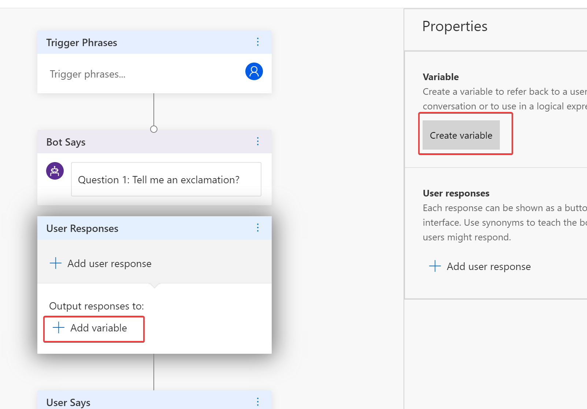

1. Lets name our variable "Answer1", set its type to "text" and then press "done".

    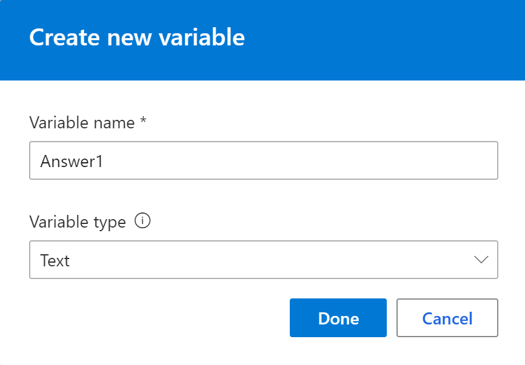

1. The bot builder will create an "expression" step in the conversation. We don't need it, so press the three little dots on the upper right of the "expression" step and delete it. 

    

    Our conversation should look like this now. 

    

1. We now need to repeat steps 20 - 24 for the next three questions. Use the following values to fill out your conversation. 

    | Question | Bot Says | Variable Name |
    | -------- | -------- | -------------- |
    | 2 | "Question 2: Tell me an adverb?" | Answer2 |
    | 3 | "Question 3: Tell me a noun?" | Answer3 |
    | 4 | "Question 4: Tell me an adjective?" | Answer4 |

    Your topic should now look like this.
 
    

1.  Now we have all the answers stored in variables, we need to put them in our story. Put the following text in a bot says block. "Answer1! he said Answer2 as he jumped into his convertible Answer3 and drove off with his Answer4 wife." 

1. Now double click on "Answer1" in the string you just entered. Then click on the "{x}" button to replace the text with the "Answer1" variable. Repeat the process for the other 3 answers. It should look like this when you are done. 

    

1. Now after we show the story to the user, the user needs to "go to" the "Mad Libs Close" topic. Select, "Go to" from the box at the end of the conversation and then pick "Mad Libs Close". it should now look like this. And then save your changes using the button in the upper right. 

    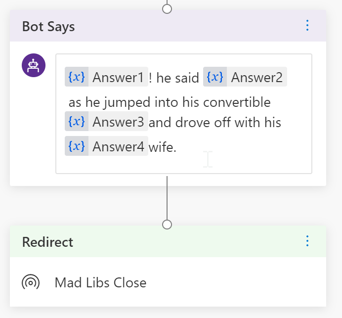

1. The last step is to connect our "story 1" topic to the "mad libs Greeting" topic. Click on "topics" on the left, then press the pencil on the "mad libs Greeting" topic. 

    

1. Find the Users Says, Story 1 block, and add a "go to" for our first story topic. And then save your changes using the button in the upper right. 

    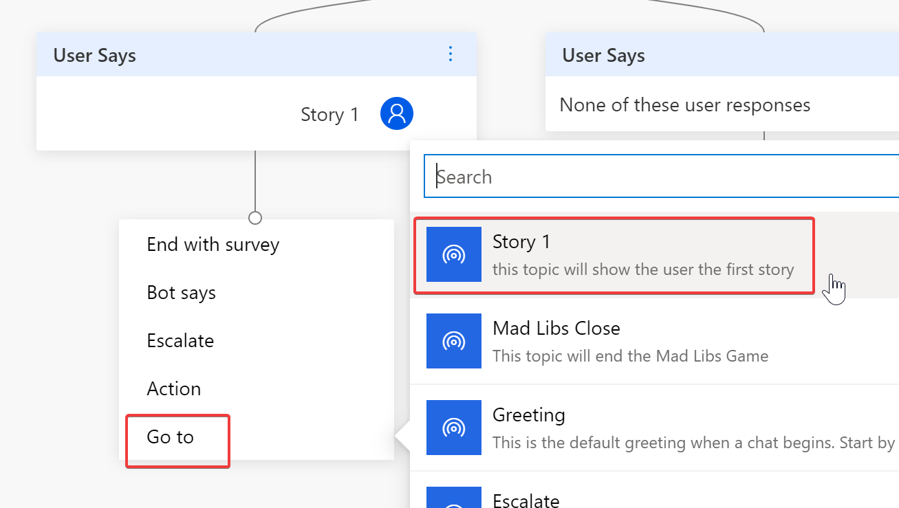

1. Great, now it is time to test out our bot! Click the "test your bot" button in the lower left of the screen.

    

1. Next press the "start over with latest content" button, and then enable the tracing switch. 

    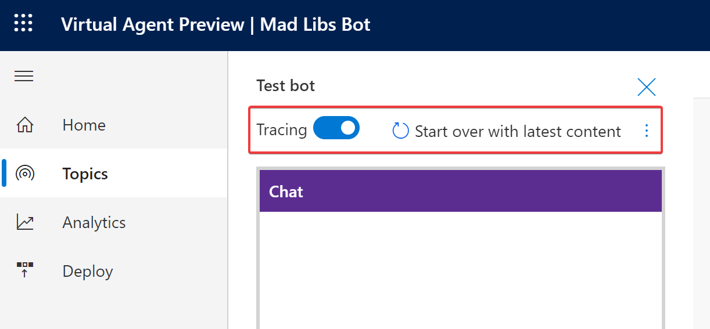

1. Now you can send any of the trigger phrases to the bot to start playing the game.

    

Done!
`